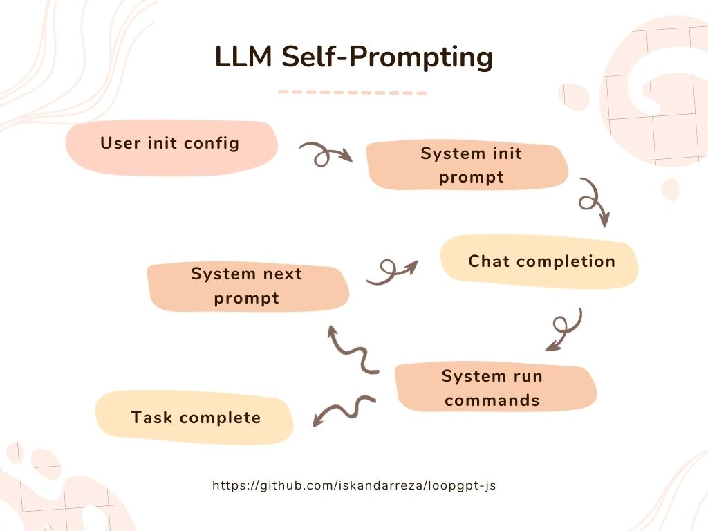

## LoopGPT-JS

A lightweight Javascript implementation of the [`loopgpt`](https://github.com/farizrahman4u/loopgpt) Python module by Fariz Rahman.
For use in browser environments, particularly off the main thread within web worker processes.

### How it works

Here's a basic rundown of how autonomous self-prompting AI agents like LoopGPT or AutoGPT work:



- User sets the initial config, which describes the agent and it's goals
- System generates an initial prompt to send to the chat completion API
- Chat completion API provides a response in a preset format that the system can process. Response may include the next command the agent decides to take
- System processes the response, runs any commands the agent includes in the last response, then generates the next prompt to send to the chat completion API
- Cycle repeats until exit conditions are met

### View the docs

[JSDoc](https://iskandarreza.github.io/loopgpt-js/)

#### Add to your node project:

```bash
npm install loopgpt-js
```

#### Usage example:

```js
const loopgpt = require('loopgpt-js')
const { Agent } = loopgpt

async function initLoop() {
  // you could save the api key(s) on a server and fetch it when needed
  const apiKeyResponse = await fetch('/api/openai', {
    method: 'POST'
  })

  const { apiKey } = await apiKeyResponse.json()

  // or you could pass it in directly
  const keys = {
    openai: apiKey,
    google: {
      googleApiKey: 'GOOGLE_API_KEY',
      googleCxId: 'CUSTOM_SEARCH_ENGINE_ID'
    }
  }

  // Create a new instance of the Agent class
  const agent = new Agent({
    keys: keys,
    goals: [
      'Run the web_search command for "California wildflowers" and then produce an overview of your findings with descriptions of each flower and their native area,'
    ]
  })

  const chat = async () => {
    let response
    response = await agent.chat({ message: null })

    while (response?.command?.name !== 'task_complete') {
      response = await agent.chat({ run_tool: true })
      console.log(agent)
      console.log(response)
    }
  }

  chat()
}

initLoop()
```

#### See Also:

https://github.com/iskandarreza/ai-worker-js -- Implementation of loopgpt-js as a dynamically created web worker in a Next/React app
